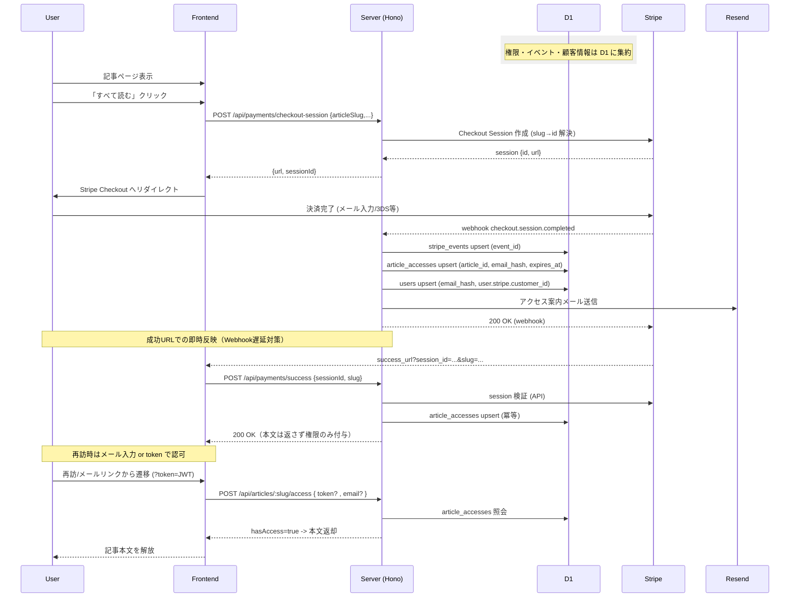

# Payment Sequence Specification

有料記事の購入シーケンスを説明します。

## 要件

- Stripe Checkout で登録したメールアドレスが有効なものか（メールが届くか）確認する
- 有料記事を期間限定で個別に無料解放する仕組みを備える
- UX を考慮し、ユーザーがスムーズに記事を閲覧できるようにする

## 草案

これらは不採用です。

### パターン 1: 簡易版

1. ユーザーが有料記事のページにアクセス
2. 「すべて読む」ボタンをクリック
3. Checkout Session を生成する API を呼び出し
4. Checkout Session の URL にリダイレクト
5. ユーザーが支払い情報とメールアドレスを入力し、支払いを完了
6. Stripe が成功 Webhook を送信
7. article_accesses テーブルに記事アクセス権限を保存
8. users テーブルに email_hash / 外部 ID を保存
9. ユーザーに「記事を読む」メールを送信
10. ユーザーがメール内のリンクをクリック
11. 記事ページでメールアドレスを入力れば閲覧可能

### パターン 2: メールアドレス確認版

1. ユーザーが有料記事のページにアクセス
2. 「すべて読む」ボタンをクリック
3. Checkout Session を生成する API を呼び出し
4. Checkout Session の URL にリダイレクト
5. ユーザーが支払い情報とメールアドレスを入力し、支払いを完了
6. Stripe が成功 Webhook を送信
7. ユーザーに「記事を読む」メールを送信
8. ユーザーがメール内のリンクをクリック
9. article_accesses テーブルに記事アクセス権限を保存
10. users テーブルに email_hash / 外部 ID を保存
11. 記事ページでメールアドレスを入力すれば閲覧可能

### パターン 3: メールアドレス確認 + UX 改善版

1. ユーザーが有料記事のページにアクセス
2. 「すべて読む」ボタンをクリック
3. Checkout Session を生成する API を呼び出し
4. Checkout Session の URL にリダイレクト
5. ユーザーが支払い情報とメールアドレスを入力し、支払いを完了
6. Stripe が成功 Webhook を送信
7. ユーザーに「記事を読む」メールを送信
8. ユーザーがメール内のリンクをクリック
9. article_accesses テーブルに記事アクセス権限を保存
10. users テーブルに email_hash / 外部 ID を保存
11. 記事ページでメールアドレスを入力すれば閲覧可能

## 推奨アーキテクチャ

採用します。

### インターフェース概要

- `POST /api/payments/checkout-session`  
  Body: `{ articleSlug: string, email?: string, currency?: string, successUrl?: string, cancelUrl?: string }`  
  Res: `{ url: string, sessionId: string }`  
  挙動: slug→id 解決、Checkout Session 作成、`success_url` に `session_id` を埋め込み。

- 成功リダイレクト時のサーバー処理（内部エンドポイント例）  
  `POST /api/payments/success` Body `{ sessionId, slug }`（サーバーのみ利用）  
  処理: Stripe API で session 検証 → `article_accesses` upsert（article_id + email_hash + expires_at）→ 200 OK を返却（本文は返さない）。

- `POST /api/payments/webhook`  
  Stripe 署名検証 → `checkout.session.completed`/`payment_intent.succeeded` で `article_accesses` upsert、`charge.refunded` 等で無効化。`stripe_events` で冪等管理。`users` に email_hash と `user.stripe.customer_id` を upsert。

- `POST /api/articles/:slug/access`  
  Body: `{ email?: string, token?: string }`（token はメールリンク等の JWT、メール入力時は email をボディで送信）  
  Res: `{ hasAccess: boolean, reason?: string, expiresAt?: number }`。`article_accesses` と突合。

- `POST /api/payments/resend-access`  
  Body: `{ articleSlug: string, email: string }`  
  Res: `{ ok: true }`  
  処理: `article_accesses` の最新有効レコードを参照し、アクセス案内を再送（insert しない）。  
  備考: 再送を使わずメール入力 + D1 照合で代替してもよい。

### シーケンス図

### 補足

- 権限のソースは D1 `article_accesses`。メールリンクの JWT トークンはメール入力を省略するための短命な補助で、署名と exp を検証した上で必ず D1 と突合する。トークンを保存する仕組みは持たない。
- Webhook 遅延時も `success_url` での Stripe API 検証で即時 upsert し、UX を担保。
- 返金/3D Secure は `stripe_events` で冪等管理し、必要に応じてアクセス無効化。

## Q&A

- トークンはどう使う？  
  メールリンク経由だけ `?token=JWT` を付け、フロントが `POST /api/articles/:slug/access` に渡してメール入力を省略する。権限のソースはあくまで D1 `article_accesses` で、トークンは署名と exp を検証しつつ D1 と突合する。一方、通常はメール入力＋D1 照合で判定する。

- `success_url?session_id=...&slug=...` の目的は？  
  Webhook 遅延を避けるため、ユーザー復帰時にサーバーが Stripe API で `session_id` を即時検証し、`article_accesses` をその場で upsert するためのフックです。本文は返さず、通常のアクセス API で返却します。

- メール入力はなぜ必要？  
  D1 の `article_accesses` と突合するため。クッキーや一時トークンが無くても、メールハッシュ照合だけで有料記事の認可を判定できます。

## 将来的な拡張性

定期購読を後付けする際も、単発権利は `article_accesses` を維持しつつ、サブスク用のテーブルを追加し、共通の判定関数で一元化する。

| 項目          | 方針                                                                                                                                  |
| ------------- | ------------------------------------------------------------------------------------------------------------------------------------- |
| 単発権利      | 現行の `article_accesses` を継続（用途を単発購入に限定、expires_at で期間管理）。返金時は無効化。                                     |
| サブスク権利  | `subscriptions`（plan/status/period_end/cancel_at）と `subscription_entitlements`（plan と article/category 紐づけ）を追加。          |
| 例外/無料付与 | 任意で `entitlement_overrides` を持ち、期間限定無料や手動付与を記録。                                                                 |
| 判定ロジック  | `resolve_access(email_hash, article_id, now)` で優先順を統一: overrides → article_accesses → subscriptions JOIN entitlements → 無効。 |
| API 拡張      | `POST /api/articles/:slug/access` で token/email を受け取り、上記判定結果を返す（最終判定は D1 権限）。                               |
